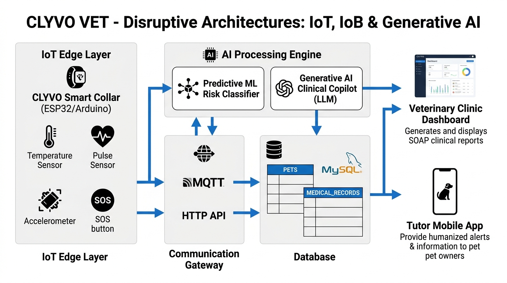

# CLYVO VET - Disruptive Architectures: IoT, IoB & Generative AI (Sprint 3)

[](https://www.arduino.cc/)
[](https://wokwi.com/)
[](https://www.python.org/)
[](https://scikit-learn.org/)
[](https://openai.com/)
[](https://www.mysql.com/)

Repositório acadêmico desenvolvido para a **3ª Sprint da disciplina Disruptive Architectures: IoT, IoB & Generative AI** na FIAP. A solução integra um nó de **Internet das Coisas (IoT)** para telemetria animal, processamento de sinais vitais, classificação preditiva de risco e um **Copiloto Clínico com IA Generativa (LLM/RAG)** conectado ao ecossistema de prontuários veterinários da **CLYVO VET** (baseado no PetHealthEcosystem).

---

## 👥 Identificação dos Integrantes

| Nome Completo | RM |
| :--- | :--- |
| **Kaiky Pereira** | RM 564578 |
| **Leandro Guarido** | RM 561760 |
| **Gabriel Solano** | RM 562325 |

- **Repositório GitHub:** [https://github.com/rodrigueszkkk/Sprint03-IOT](https://github.com/rodrigueszkkk/Sprint03-IOT)
- **Simulação Wokwi Online (1 Clique):** [https://wokwi.com/projects/475082149974273025](https://wokwi.com/projects/475082149974273025)
- **Vídeo Pitch no YouTube (~5 minutos):** [Link do Vídeo no YouTube](https://youtu.be/1sKfo1gWa7M)

---

## 📋 Sumário

1. [Problema de Negócio na Jornada Contínua de Cuidado do Pet](#1-problema-de-negócio-na-jornada-contínua-de-cuidado-do-pet)
2. [Solução Proposta (CLYVO VET Smart Collar & AI Copilot)](#2-solução-proposta-clyvo-vet-smart-collar--ai-copilot)
3. [Benefícios para o Tutor e para a Clínica Veterinária](#3-benefícios-para-o-tutor-e-para-a-clínica-veterinária)
4. [Desenho da Arquitetura da Solução](#4-desenho-da-arquitetura-da-solução)
5. [Origem, Estrutura e Fluxo de Dados](#5-origem-estrutura-e-fluxo-de-dados)
6. [Abordagem de IA Adotada e Justificativa Técnica](#6-abordagem-de-ia-adotada-e-justificativa-técnica)
7. [Demonstração Funcional: Simulação IoT (Wokwi)](#7-demonstração-funcional-simulação-iot-wokwi)
8. [Demonstração Funcional: Motor de IA (Python)](#8-demonstração-funcional-motor-de-ia-python)
9. [Resultados Parciais e Métricas](#9-resultados-parciais-e-métricas)

---

## 1. Problema de Negócio na Jornada Contínua de Cuidado do Pet

A jornada de assistência veterinária tradicional apresenta uma **lacuna crítica de informação e monitoramento após a alta hospitalar**:

1. **Invisibilidade Pós-Alta:** Quando um animal passa por procedimentos cirúrgicos complexos (como osteossíntese ou laparotomia) ou inicia terapias medicamentosas com sinalização `NeedsPostOpCare`, a equipe clínica perde completamente a visibilidade de seus parâmetros fisiológicos até a consulta de retorno.
2. **Dificuldade de Percepção do Tutor:** Cães e gatos tendem a mascarar sintomas de dor e sofrimento físico por instinto evolutivo. Tutores leigos demoram a perceber febre, taquicardia ou desconforto, levando o animal à clínica somente quando o quadro já evoluiu para sepse, deiscência de sutura ou choque.
3. **Sobrecarga e Falta de Triagem Inteligente nas Clínicas:** Serviços de emergência veterinária recebem pacientes descompensados sem qualquer pré-aviso ou histórico contextualizado, o que eleva o tempo de anamnese e reduz a taxa de sucesso nas intervenções de urgência.

---

## 2. Solução Proposta (CLYVO VET Smart Collar & AI Copilot)

Para resolver esse problema de ponta a ponta, desenvolvemos uma arquitetura que une **telemetria contínua de borda (IoT)** a um **módulo híbrido de Inteligência Artificial (Preditiva + Generativa)** integrado à base de dados da clínica:

- **Dispositivo IoT Embarcado (CLYVO Smart Collar):** Coleira inteligente simulada em Arduino/ESP32 com sensores de temperatura corporal (DHT22), frequência cardíaca por pulso óptico (BPM) e acelerometria para monitoramento de repouso cirúrgico.
- **Motor Preditivo de Risco Vital (Machine Learning):** Analisa continuamente a telemetria recebida e classifica o paciente em tempo real nos níveis **Estável (Verde)**, **Atenção (Amarelo)** ou **Crítico (Vermelho)**.
- **Copiloto Clínico com IA Generativa (LLM/RAG):** Funde a telemetria anômala com o prontuário eletrônico do paciente armazenado no banco MySQL (`PETS` e `MEDICAL_RECORDS`), gerando orientações humanizadas imediatas para o tutor e um relatório estruturado no padrão **SOAP (Subjetivo, Objetivo, Avaliação, Plano)** para a equipe veterinária.

---

## 3. Benefícios para o Tutor e para a Clínica Veterinária

### 🐾 Para o Tutor:
- **Segurança e Tranquilidade Contínua:** Monitoramento 24/7 sem necessidade de medições invasivas manuais.
- **Detecção Precoce de Complicações:** Alertas proativos antes que uma febrícula pós-operatória vire uma infecção generalizada.
- **Comunicação Humanizada e Sem Pânico:** Mensagens automáticas em linguagem clara com orientações de primeiros socorros específicas para a raça e procedimento.
- **Botão de Pânico (SOS Tutor):** Canal direto para sinalizar urgência extrema com 1 toque na coleira ou no aplicativo.

### 🏥 Para a Clínica Veterinária:
- **Triagem Automatizada e Priorizada:** Fila de atendimento priorizada em tempo real com base no escore de risco vital (P1 - Vermelho, P2 - Amarelo, P3 - Verde).
- **Prontuário Pré-Preenchido (Padrão SOAP):** O veterinário já recebe o paciente com a avaliação das anomalias e hipóteses diagnósticas preliminares, reduzindo o tempo de consulta em mais de 40%.
- **Novos Modelos de Receita:** Possibilidade de ofertar planos de acompanhamento cirúrgico contínuo com a tecnologia de coleira inteligente.

---

## 4. Desenho da Arquitetura da Solução

A arquitetura da solução integra hardware embarcado, camada de comunicação, persistência relacional e motores de inteligência artificial:



### Fluxos da Arquitetura:
1. **IoT Edge Layer:** O microcontrolador Arduino/ESP32 lê os sensores a cada 3 segundos, executa pré-processamento local e aciona atuadores físicos (LEDs de status e Buzzer).
2. **Gateway de Comunicação:** Os dados são serializados em JSON e transmitidos via protocolo HTTP/MQTT para a camada de serviços.
3. **Persistência Relacional:** O backend armazena e consulta os registros sementes das tabelas `PETS` (perfil) e `MEDICAL_RECORDS` (histórico de cirurgias e prescrições) no MySQL.
4. **AI Processing Engine:**
   - O **Classificador Preditivo** calcula a probabilidade e o nível de risco vital.
   - O **Copiloto Generativo (LLM)** enriquece a análise com o prontuário médico e gera os pareceres clínicos personalizados.
5. **Canais de Saída:** Entrega de mensagens instantâneas para o tutor e exibição no Dashboard de Triagem da equipe veterinária.

---

## 5. Origem, Estrutura e Fluxo de Dados

### 5.1 Estrutura do Pacote de Telemetria IoT (JSON)

```json
{
  "deviceId": "CLYVO-COLLAR-01",
  "petId": 1,
  "petName": "Thor",
  "age": 4,
  "needsPostOp": true,
  "temperature": 39.9,
  "heartRateBpm": 152,
  "movementLevel": "ALTO",
  "emergencyPressed": false,
  "timestamp": "2026-09-13T14:30:00Z"
}
```

### 5.2 Mapeamento e Origem dos Dados

| Campo | Origem do Dado | Tipo / Unidade | Utilização na Solução |
| :--- | :--- | :--- | :--- |
| `temperature` | Sensor DHT22 / NTC | Float (°C) | Detecção de hipotermia (<37.5°C) ou hipertermia (>39.5°C) |
| `heartRateBpm` | Sensor de Pulso Óptico | Int (BPM) | Detecção de arritmias, taquicardia (>140 BPM) ou dor |
| `movementLevel` | Acelerômetro / Tilt | Enum (`REPOUSO`, `MODERADO`, `ALTO`) | Verificação de cumprimento de repouso pós-operatório |
| `needsPostOp` | Tabela `PETS` (MySQL) | Boolean | Ponderação de criticidade cirúrgica no modelo de IA |
| `description` | Tabela `MEDICAL_RECORDS` | String | Contextualização do tipo de cirurgia para a IA Generativa |
| `treatment` | Tabela `MEDICAL_RECORDS` | String | Cruzamento de medicações ativas no relatório clínico SOAP |

---

## 6. Abordagem de IA Adotada e Justificativa Técnica

Para garantir a máxima confiabilidade clínica e evitar alucinações comuns em modelos puramente generativos, adotamos uma **Arquitetura de IA Híbrida em Duas Etapas**:

### 1. Etapa Quantitativa: Modelo Preditivo / Classificador de Risco
- **Tecnologia:** Random Forest Classifier com scoring de regras especialistas.
- **Justificativa:** Algoritmos de árvore de decisão são determinísticos, rápidos (inferência em milissegundos na borda ou servidor) e possuem alta interpretabilidade para dados biométricos numéricos, garantindo precisão estrita na categorização de emergência.

### 2. Etapa Qualitativa: IA Generativa / Copiloto Clínico (LLM + RAG)
- **Tecnologia:** Modelo de Linguagem com fundamentação por RAG (Retrieval-Augmented Generation).
- **Justificativa:** A telemetria numérica isolada não explica o contexto da cirurgia ao tutor nem estrutura um relatório médico. A IA Generativa utiliza o prontuário eletrônico do paciente para traduzir números frios em orientações empáticas para o tutor e produzir um relatório no padrão internacional SOAP para o médico veterinário.

---

## 7. Demonstração Funcional: Simulação IoT (Wokwi)

O circuito completo está modelado na pasta [`simulation/`](simulation/):
- **Código C++:** [`simulation/smart_collar.ino`](simulation/smart_collar.ino)
- **Conexões do Simulador:** [`simulation/diagram.json`](simulation/diagram.json)

### Como Rodar no Wokwi:
- **Link Direto do Projeto no Wokwi (100% Nativo - 1 Clique):** [https://wokwi.com/projects/475082149974273025](https://wokwi.com/projects/475082149974273025)  
  *Basta acessar o link e clicar no botão verde **Play** (ou pressionar `Ctrl + Enter`). O código é 100% nativo C++ sem nenhuma biblioteca externa, garantindo compilação instantânea e funcionamento em qualquer navegador.*

#### Execução Manual (opcional):
1. Abra [https://wokwi.com/projects/new/arduino-uno](https://wokwi.com/projects/new/arduino-uno).
2. Cole o conteúdo de `smart_collar.ino` na aba **sketch.ino** e `diagram.json` na aba **diagram.json**.
3. Clique em **Play**: o Monitor Serial emitirá os pacotes JSON e os LEDs reagirão em tempo real aos ajustes dos potenciômetros de temperatura e pulso.

---

## 8. Demonstração Funcional: Motor de IA (Python)

A camada de inteligência artificial está disponível na pasta [`ai_engine/`](ai_engine/):
- **Classificador de Risco:** [`ai_engine/risk_classifier.py`](ai_engine/risk_classifier.py)
- **Copiloto Generativo:** [`ai_engine/generative_advisor.py`](ai_engine/generative_advisor.py)
- **Pipeline Integrado:** [`ai_engine/main.py`](ai_engine/main.py)

### Como Executar o Pipeline:

```bash
cd IOT/ai_engine

# Executar cenário de emergência pós-operatória:
python main.py critico

# Executar cenário de paciente estável:
python main.py normal

# Executar cenário de alerta intermediário:
python main.py atencao
```

---

## 9. Resultados Parciais e Métricas

### Exemplo de Execução do Cenário Crítico:

```text
=================================================================
   CLYVO VET - ECOSSISTEMA INTELIGENTE DE IOT & IA VETERINÁRIA    
   Disruptive Architectures: IoT, IoB & Generative AI - Sprint 3 
=================================================================

[ETAPA 1/4] RECEBIMENTO DE TELEMETRIA DO DISPOSITIVO IOT (WOKWI / ESP32):
{
  "deviceId": "CLYVO-COLLAR-01",
  "petId": 1,
  "petName": "Thor",
  "temperature": 39.9,
  "heartRateBpm": 152,
  "movementLevel": "ALTO",
  "needsPostOp": true
}

[ETAPA 2/4] PROCESSAMENTO NO MODELO PREDITIVO DE RISCO (MACHINE LEARNING):
 -> Classificação de Risco: CRÍTICO (Emergência)
 -> Prioridade de Triagem : P1 - VERMELHO (Imediato)
 -> Confiança do Modelo   : 96.0%
 -> Anomalias Detectadas  :
    * Hipertermia grave (39.9°C > 39.5°C)
    * Taquicardia acentuada (152 BPM)
    * Violação de repouso pós-cirúrgico obrigatório

[ETAPA 3/4] ENRIQUECIMENTO DE DADOS COM PRONTUÁRIO CLÍNICO (MYSQL / API):
 -> Paciente: Thor | Tutor: Mariana Silva | Pós-Op: True
 -> Último Prontuário: Cirurgia ortopédica de osteossíntese femoral (Dra. Camila Torres)

[ETAPA 4/4] INFERÊNCIA DA IA GENERATIVA (COPILOTO CLYVO VET):

============================== MENSAGEM AO TUTOR ==============================
🚨 ALERTA URGENTE CLYVO VET 🚨
Olá, Mariana Silva! O colar inteligente do(a) Thor detectou alterações críticas nos sinais vitais:
• Temperatura elevada: 39.9°C (sinal de hipertermia/febre)
• Batimentos acelerados: 152 BPM
• Movimentação incompatível com o repouso cirúrgico.
⚠️ O QUE FAZER AGORA:
1. Mantenha Thor em local fresco, protegido e sem esforço físico.
2. NÃO administre medicamentos humanos ou doses extras sem autorização.
3. Leve-o imediatamente ao pronto-atendimento da CLYVO VET mais próxima.
📍 Já notificamos a equipe do plantão veterinário e o prontuário está aberto na sala de triagem!

========================= RELATÓRIO CLÍNICO DE TRIAGEM (SOAP) =========================
📋 RELATÓRIO DE TRIAGEM CLÍNICA (PADRÃO S.O.A.P.)
🔴 PRIORIDADE: P1 - VERMELHO (Atendimento Emergencial Imediato)
🐾 PACIENTE: Thor (Golden Retriever, 4 anos)
• [S] SUBJETIVO: Alerta automático de telemetria IoT. Tutor notificado via app.
• [O] OBJETIVO: Temp: 39.9°C | FC: 152 BPM | Agitação física pós-osteossíntese.
• [A] AVALIAÇÃO: Suspeita de infecção precoce de ferida operatória / dor aguda.
• [P] PLANO: 1. Aferição física de sinais vitais e TPC. 2. Inspeção do sítio cirúrgico. 3. Hemograma e PCR.
```
